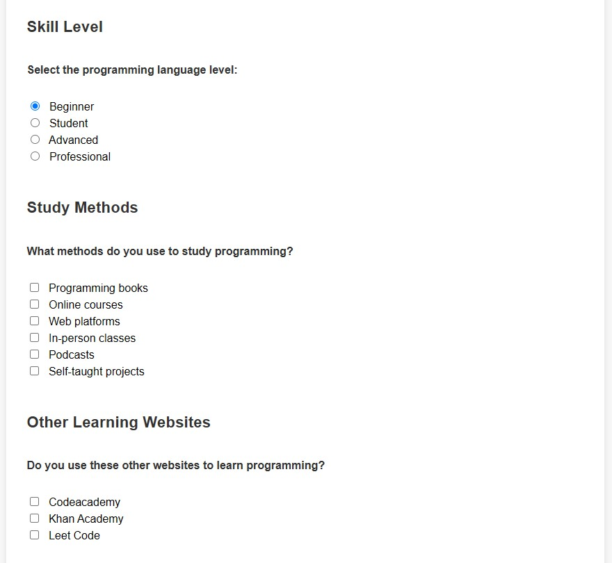

## **Ejercicio 1: crear una estructura de etiquetas semánticas en HTML**  

- [Semántica en HTML](https://www.w3schools.com/html/html5_semantic_elements.asp)

### Etiquetas semánticas

Plantillas:
- [W3schools template](https://www.w3schools.com/html/html_responsive.asp)
- [W3schools Flex Template](https://www.w3schools.com/Css/css3_flexbox_responsive.asp)
- [W3schools Responsive Templates](https://www.w3schools.com/Css/css_rwd_templates.asp)

--- Solución del ejercicio 1 (capturas y comentarios) ---

Elige 1 de los 5 ejercicios del itinerario de Responsive Web Design de FreeCodeCamp para este ejercicio:

#### Survey Form

Capturas de pantalla: 

