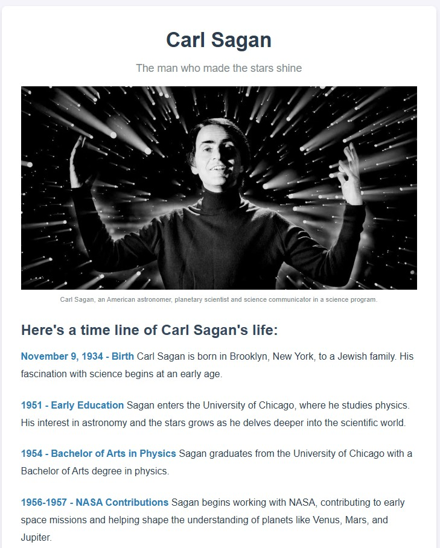
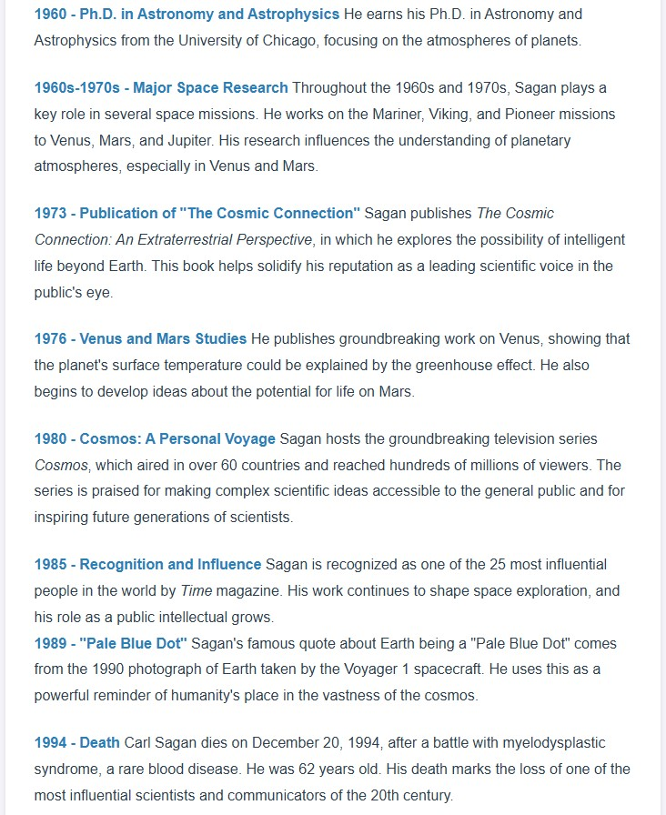
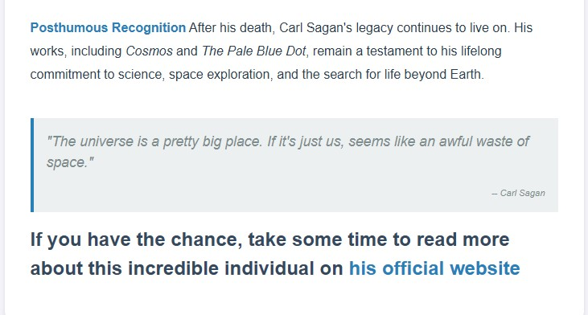

## **Ejercicio 2: diseño mobile first**  

El diseño se debe pensar para funcionar en móvil primero y a partir de este diseño inicial ampliamos los estilos para tablet y desktop.

- [Plantilla de media queries #1](https://gist.github.com/gokulkrishh/242e68d1ee94ad05f488)
- [Plantilla de media queries #2](https://gist.github.com/mavieth/e0c8fdcb72a30d85f57a)

Además de los tests de FreeCodeCamp para el ejercicio, se valorará los estilos:

- [ ] El diseño debe ser adecuado para una pantalla móvil
- [ ] El diseño debe permitir el uso correcto de la página en mobile
- [ ] El diseño debe funcionar correctamente en pantallas desktop 

--- Solución del ejercicio 2 (capturas y comentarios) ---

Elige 1 de los 5 ejercicios del itinerario de Responsive Web Design de FreeCodeCamp para este ejercicio:

#### Tribute Page

Capturas de pantalla:

