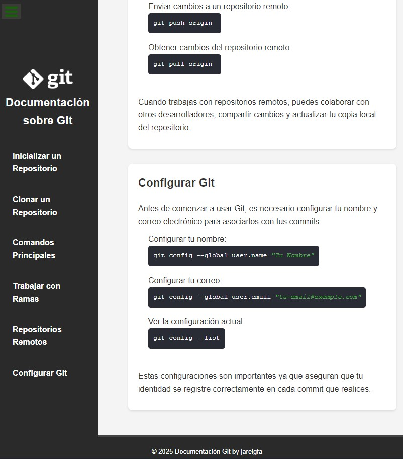

## **Ejercicio 3: página responsive con SEO**  

El objetivo de este ejercicio es hacer que nuestra página tenga las etiquetas &lt; meta &gt; correctas para el SEO.

- [Etiquetas meta en W3schools](https://www.w3schools.com/tags/tag_meta.asp)
- [Más sobre etiquetas meta](https://blog.hubspot.com/marketing/meta-tags)
- [Generador de meta tags](https://metatags.io/)

--- Solución del ejercicio 3 (capturas y comentarios) ---

Elige 1 de los 5 ejercicios del itinerario de Responsive Web Design de FreeCodeCamp para este ejercicio:

#### Technical Documentation Page

Enlace CodePen: https://codepen.io/jareigfa/full/mydBORQ

Capturas de pantalla:

